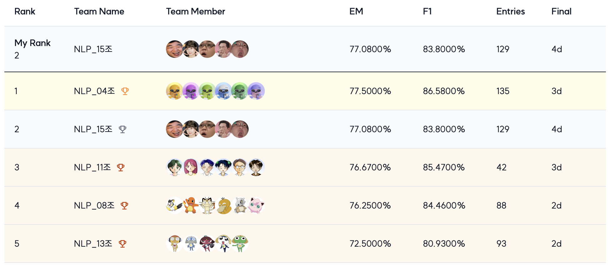
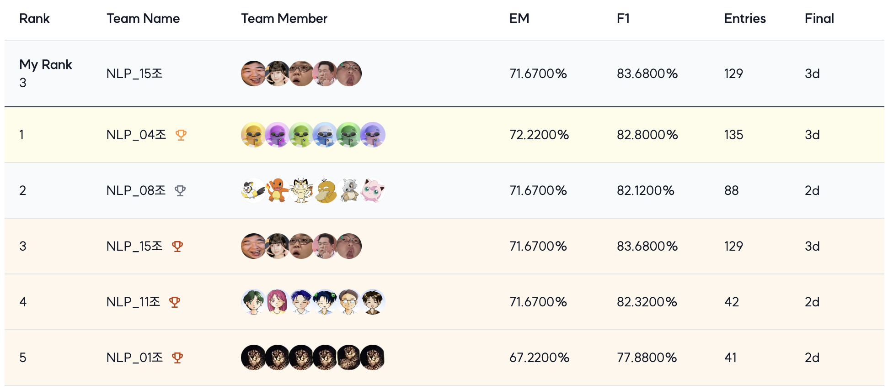

<div align='center'>

  # 🏆 LV.2 NLP 프로젝트 : Open-Domain Question Answering

</div>

## ✏️ 대회 소개

| 특징     | 설명 |
|:------:| --- |
| 대회 주제 | 네이버 부스트캠프 AI Tech 7기 NLP Track의 Level 2 도메인 기초 대회 'Open-Domain Question Answering (Machine Reading Comprehension)'입니다. |
| 대회 설명 | 주어지는 Documents의 내용을 기반으로 질문이 주어지면, 그 질문에 대한 정확한 답변을 문서에서 찾아내는 것을 목표로 합니다. |
| 데이터 구성 | 데이터는 위키피디아의 내용으로 대부분 이루어진 문서 데이터, 그리고 Question과 Answer로 구성되어 있습니다. |
| 평가 지표 | 답변을 정확히 추출하는지를 확인하기 위해 EM(Exact Match) 지표가 사용되었습니다.|


## 🎖️ Leader Board
프로젝트 결과 Public 리더보드 2등, Private 리더보드 2등 (공동 EM Score)을 기록하였습니다.
###  Public Leader Board 


###  Private Leader Board 


## 👨‍💻 15조가십오조 멤버
<div align='center'>
  
| 김진재 [](https://github.com/jin-jae) | 박규태 [](https://github.com/doraemon500) | 윤선웅 [](https://github.com/ssunbear) | 이정민 [](https://github.com/simigami) | 임한택 [](https://github.com/LHANTAEK)
|:-:|:-:|:-:|:-:|:-:|
|  |  |  |  |  |

</div>

  
## 👼 역할 분담
<div align='center'>

|팀원   | 역할 |
|------| --- |
| 김진재 | 베이스라인 코드 작성, 조사 전처리 알고리즘 개발, 앙상블 |
| 박규태 | 데이터 특성 분석, EDA, Retrieval 구현, 비교 실험 및 개선(하이브리드 서치. Re-ranking, Dense 등등), Reader 모델 파인튜닝 |
| 윤선웅 | KorQuAD 1.0 데이터 증강, 모델 파인튜닝, Reader 모델 개선(CNN layer 추가), Retrieval 모델 구현(BM25), 앙상블   |
| 이정민 | 데이터 증강 (AEDA, Truncation 등), Question 데이터셋 튜닝, Korquad 데이터셋 튜닝 |
| 임한택 | EDA, Retrieval 모델 개선(BM25Plus, Re-ranking 하이퍼파라미터 최적화), Reader 모델 개선(PLM 선정 및 Trainer 파라미터 최적화)   |

</div>


## 🏃 프로젝트
### 🖥️ 프로젝트 개요
|개요| 설명 |
|:------:| --- |
| 주제 | 기계 독해 MRC (Machine Reading Comprehension) 중 ‘Open-Domain Question Answering’ 를 주제로, 주어진 질의와 관련된 문서를 탐색하고, 해당 문서에서 적절한 답변을 찾거나 생성하는 task를 수행 |
| 구조 | Retrieval 단계와 Reader 단계의 two-stage 구조 사용 |
| 평가 지표 | 평가 지표로는 EM Score(Exact Match Score)이 사용되었고, 모델이 예측한 text와 정답 text가 글자 단위로 완전히 똑같은 경우에만 점수 부여 |
| 개발 환경 | `GPU` : Tesla V100 Server 4대, `IDE` : Vscode, Jupyter Notebook  |
| 협업 환경 | Notion(진행 상황 공유), Github(코드 및 데이터 공유), Slack(실시간 소통), W&B(시각화, 하이퍼파라미터 튜닝)  |

### 📅 프로젝트 타임라인
- 프로젝트는 2024-09-30 ~ 2024-10-25까지 진행되었습니다.

<div align='center'>


</div>

### 🕵️ 프로젝트 진행
- 프로젝트를 진행하며 단계별로 실험하여 적용한 내용들을 아래와 같습니다.


|  프로세스   | 설명 |
|:-----------------:| --- |
| 데이터 처리  | AEDA, Swap Sentence, Truncation, Mecab을 활용한 Question 강조, LLM기반 조사제거 |
| 모델 Finetuning  | Korquad dataset 추가, Korquad1 PLM에 Korquad2 데이터셋 fine-tuning |
| Retriever 모델 개선 | BM25Plus, DPR, Hybrid Search, Re-rank(2-stage) |
| Reader 모델 개선 | CNN Layer 추가, Head Customizing, Dropout, Learning rate 튜닝 |
| 앙상블 방법 | Soft Voting: nbest_predictions.json에서 제공하는 단어별 확률값을 활용해서, 각 파일에서 단어의 확률값을 평균낸 후 가장 높은 값을 선택하는 방식 |


### 🤖 Ensemble Model
| 번호 | 모델+기법                                               | EM(Public) |
|------|--------------------------------------------------------|------------|
| 1    | uomnf97+BM25+CNN                                       | 66.67      |
| 7    | Curtis+CNN+dropout(only_FC_0.05)+BM25Plus            | 66.25      |
| 8    | Curtis+Truncation                                      | 66.25      |
| 9    | HANTAEK_hybrid_optuna_topk20(k1=1.84)                 | 63.15      |
| 10   | HANTAEK_hybrid_optuna_topk20(k1=0.73)                 | 63.75      |
| 11   | HANTAEK_hybrid_optuna_topk10(k1=0.73)                 | 63.75      |
| 12   | uomnf97+BM25                                          | 67.08      |
| 13   | uomnf97+CNN+Re_rank500_20+Cosine                     | 67.08      |
| 14   | curtis+CNN+Re_rank_500_20                             | 65.42      |
| 15   | nlp04_finetuned+CNN+BM25Plus+epoch1_predictions      | 67.5       |


| 최종제출 | Ensemble                                           | EM(Public) | EM(Private) |
|----------|----------------------------------------------------|------------|--------------|
| O        | 모델 7,8,9,10,11,12,13 1:1:1:1:1:2:3 앙상블 + 조사 LLM | **77.08**      | 71.11        |
| O        | 모델 14,8,15,10,11,12,13 1:1:1:1:2:3 앙상블 + 조사 LLM | **77.08**      | 71.67        |
|          | 모델 1,7,8,9,10,11,12 평균앙상블 + 조사 LLM        | 76.67      | 71.67        |
|          | 모델 7,8,9,10,11,12,13 1:1:1:2:2:2 앙상블 + 조사 LLM | 76.67      | 70.83        |
| 1st SOTA | 모델 15,9,10,11,12,13 1:1:1:1:3:3 앙상블 + 조사 LLM  | 75.42      | **74.17**        |
|          | 모델 7,8,9,10,11,12,13 1:1:1:1:2:3 앙상블 + 조사 LLM(n=5) | 75.42      | 71.67        |
|          | 모델 7,8,9,10,11,12,13,14 1:1:1:1:2:2 앙상블 + 조사 LLM | 74.58      | 71.11        |
| 2nd SOTA | 모델 14,8,9,10,11,12,13 1:1:1:1:2:3 앙상블 + 조사 LLM | 74.58      | **72.22**        |


## 📁 프로젝트 구조
프로젝트 폴더 구조는 다음과 같습니다.
```
.
├── data
│   ├── test_dataset
│   ├── train_dataset
│   └── wikipedia_documents.json
├── models
├── output
├── README.md
├── requirements.txt
├── run.py
└── src
    ├── arguments.py
    ├── CNN_layer_model.py
    ├── data_analysis.py
    ├── ensemble
    │   ├── probs_voting_ensemble_n.py
    │   ├── probs_voting_ensemble.py
    │   └── scores_voting_ensemble.py
    ├── main.py
    ├── optimize_retriever.py
    ├── preprocess_answer.ipynb
    ├── qa_trainer.py
    ├── retrieval_2s_rerank.py
    ├── retrieval_BM25.py
    ├── retrieval_Dense.py
    ├── retrieval_hybridsearch.py
    ├── retrieval.py
    ├── retrieval_SPLADE.py
    ├── retrieval_tfidf.py
    └── utils.py
```

### 📦 src 폴더 구조 설명
- TBD


### 💾 Installation
- `python=3.10` 환경에서 requirements.txt를 pip로 install 합니다. (```pip install -r requirements.txt```)
- `python run.py`를 입력하여 프로그램을 실행합니다.
